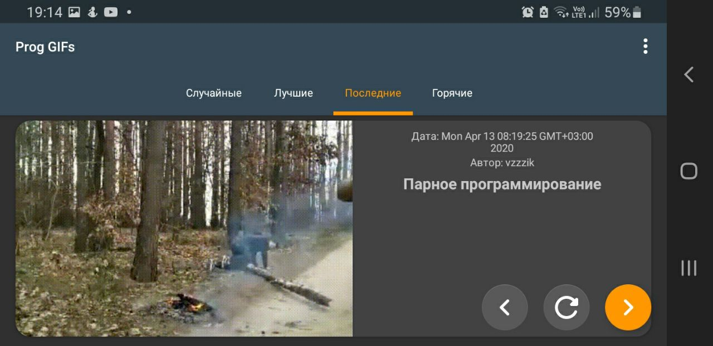
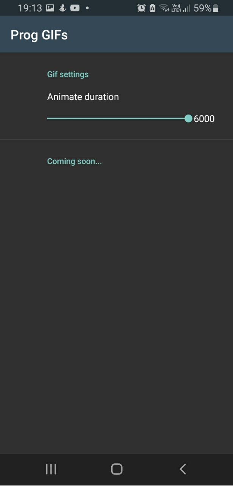

# ProgGIFs - Tinkoff Fintech 2021
## Описание
### Android приложение на Kotlin для отображение интернет гифок на прогерскую тематику. 
### Выполнил: Романюк Андрей (asromanyuk@edu.hse.ru)
### Срок выполнения: 1 день
## Библиотеки
1. Retrofit + OkHTTP - использовал для создания GET-запросов, оборачивал запросы в **Call**, что позволило не использовать Kotlin корутины в прокте. С помощью **Logging-interceptor** выполнял логгирование запросов.
2. Glide - использовал для отображения GIF - изображений. Библиотека позволила предварительно грузить картинку, перед тем как загружать большую гифку. Помимо этого библиотека обеспечивает простую настройку кэширования загруженных изображений и обработку неудачных загрузок. 
3. Timber - легкая библиотечка для удобного логгирования.

Остальные библиотеки, не нуждающиеся в описании: ViewModel, Lifecycle, ViewPager2, Preference, ConstraintLayout

## Что было дополнительно проделано?
1. Чистая архитектура с MVVM.
2. Поддержка тёмной и светлой темы 
3. Поддержка пейзажного режима 
4. Анимация появления изображения с настройкой через SharedPreference  

## License

**Prog GIFs** is licensed under the [GNU General Public License v3.0](https://github.com/goga133/HSECoffee/blob/main/LICENSE).