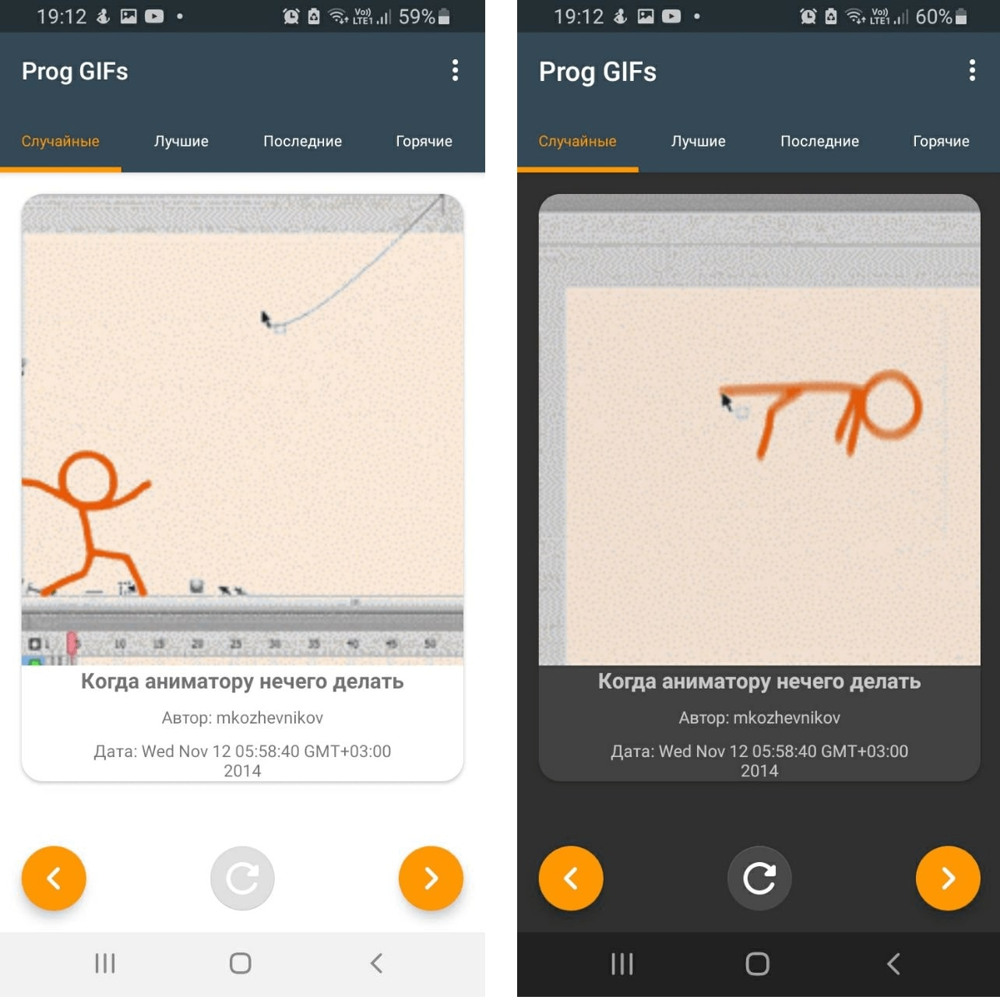
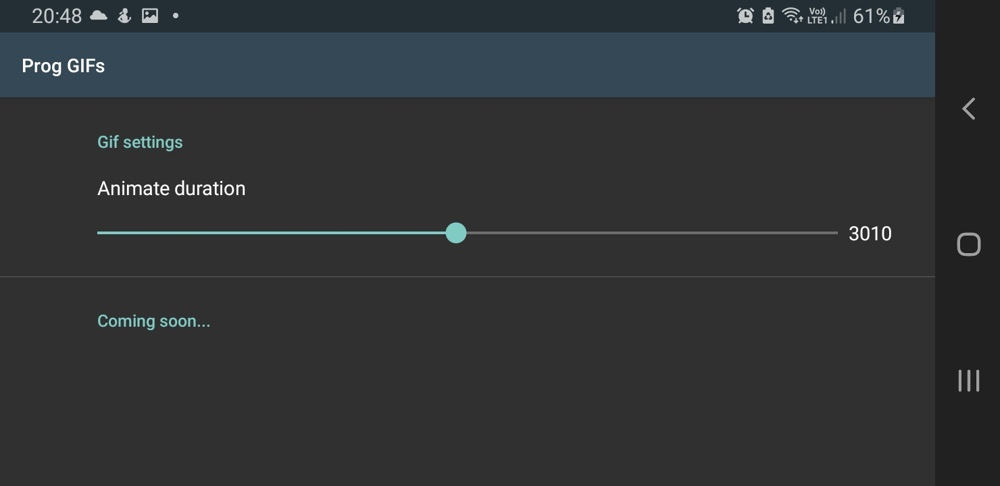

# ProgGIFs - Tinkoff Fintech 2021
## Описание
### Android приложение на Kotlin для отображения интернет гифок на прогерскую тематику. 
### Выполнил: Романюк Андрей (asromanyuk@edu.hse.ru)
### Срок выполнения: 1 день
## Библиотеки
1. Retrofit + OkHTTP - использовал для создания GET-запросов, оборачивал запросы в **Call**, что позволило не использовать Kotlin корутины в проекте. С помощью **Logging-interceptor** выполнял логгирование запросов.
2. Glide - использовал для отображения GIF - изображений. Перед тем как загрузить тяжёлую гифку, загружается превью и отображется. Помимо этого библиотека обеспечивает простую настройку кэширования загруженных изображений и обработку неудачных загрузок. 
3. Timber - легкая библиотечка для удобного логгирования.

Остальные библиотеки, не нуждающиеся в описании: ViewModel, Lifecycle, ViewPager2, Preference, ConstraintLayout

## Что было дополнительно проделано?
1. Чистая архитектура с MVVM.
2. Отображение GIF с разных разделов: популярные, последние, горячие.
3. Поддержка тёмной и светлой темы 
4. Поддержка пейзажного режима 
5. Анимация появления изображения с настройкой через SharedPreference  

## А что с модульными и UI тестами?
Во время ручного тестирования мне очень понравилась вот эта гифка 

## Демонстрация
](https://youtu.be/40yNIcs5RiM)

## Сборка
Итоговый вес приложения: *1993 КБ* [Скачать](https://github.com/goga133/Fintech2021-Android/releases) 

## License

**Prog GIFs** is licensed under the [MIT License](LICENSE).
